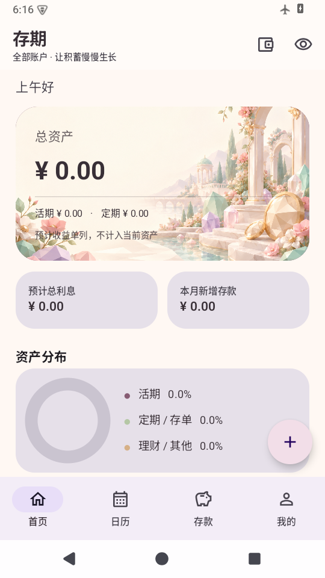

# 存期 · 个人存款与固定收益资产管理

全中文 Android 原生应用。管理活期、多账户、自动月存、定期与固定收益、到期回款、提前支取和转存链。完全离线，不需要账号、服务器、Firebase 或 Google Play Services，不声明互联网或其他敏感权限。

## 下载和安装

**[下载签名 Release APK：存期.apk](https://github.com/JiaYunSong/Budget-APP/raw/refs/heads/main/releases/%E5%AD%98%E6%9C%9F.apk)**（Android 8.0 / API 26 及以上）。

下载到手机，打开 APK，根据系统提示允许该文件管理器安装应用。安装后直接创建活期账户。APK 是通用包，包含 arm64-v8a、armeabi-v7a、x86 和 x86_64 所需依赖，不依赖开发电脑。

校验文件见 [releases/SHA256SUMS](releases/SHA256SUMS)。版本：1.1.0，包名：`com.local.deposittracker`。签名发行包在 [releases](releases/) 目录；CI 的 Debug 包和未签名 Release 包仅用于开发。

## 已实现功能

- 首页：总资产、活期余额、定期本金、预计利息、资产分布、本月现金变动、即将到期。
- 六个新增入口：一次性存款、一次性取款、固定收入（每月规则）、投资（固定收益资产）、自动月存、账户间转账。
- 顶部钱包按钮可新建账户、选择单账户或多账户合并统计；记录时可选择各账户。
- 洛可可柔和粉色、奶油白与香槟金配色，生成的低多边形花园背景，圆角卡片和平滑环形图。
- 多活期账户：外部存入 / 支出、余额更正、账户间转账、是否计入总资产。
- 定期 / 大额存单 / 固定收益理财 / 国债 / 其他：按实际天数、按月、手动到期金额三种计息。
- 自动月存：启动、恢复前台或进入首页时补记；短月的 31 日规则使用该月最后一天。
- 到期本金及利息自动进入指定账户；提前支取按实际到账金额；已到期产品可转存并保留完整链路。
- 月日历、12 个月年度统计、全部流水与类型筛选；存款搜索、状态筛选和多种排序。
- JSON 完整备份和覆盖恢复，保留 ID、余额、历史、规则执行游标、转存关系及设置。
- UTF-8 BOM CSV 导出；CSV 导入先显示预览、错误行号及疑似重复，可跳过重复。
- 亮色 / 深色 / 跟随系统、隐藏金额、应计收益开关、应用内到期提示、30 天备份提醒。

新版首页预览：



本次行为调整和删除规则详见 [1.1.0 修订说明](docs/revisions-1.1.md)。

## 资金原则

金额以整数“分”保存；利率以十进制字符串保存，并用 `BigDecimal` 计算，不使用浮点数进行资金运算。

活期转定期、定期回活期、账户转账是内部转移；只有外部存入 / 支出和实际利息改变净资产。默认总资产不包含预计利息，可选择计入按日计息产品的应计收益。关闭账户“计入总资产”后，其来源定期一起排除。

**自动月存只是本地记账，不会操作银行账户。** 停用期间不执行，重新启用后补记规则日期内尚未执行的月份；删除规则会清除对应存款流水并撤销账户入账金额；单独删除月存流水不会重新补记该月份。每次变动、补记和到期结算都在 Room 事务中处理，同一事件有唯一流水 ID。重复打开和时间倒退不会重复入账。

开始日期不能晚于今天；创建已经到期的历史资产会立即回款。开始后本金、日期及计息条件锁定，进行中可修改名称、备注和到期账户；已结算产品仅可改名称与备注，保留实际回款去向。提前支取的实际到账日期不能使用未来日期。余额更正使用活期调整并记录流水；可归档历史产品；从日历删除投资流水会撤销该产品、关联回款及后续转存。余额不足默认拒绝，可以明确选择仍然创建负余额。

月视图、年视图和全部流水只展示截至今天的实际记录，支持新增和删除；未来尚未发生的月存和回款不显示。利息以银行回款为准。第一版仅提供**打开应用时的到期提示**，关闭应用时不发送通知，不使用后台常驻或 GMS。

## 备份和 CSV

“我的 → 数据管理”使用系统文件选择器，不硬编码目录，也不申请广泛存储权限。完整备份包含敏感财务信息，请妥善保管。卸载会删除本地数据；系统自动云备份和设备转移均关闭，请主动导出 JSON。

JSON 导入先显示备份时间和账户、定期、规则、流水数量，确认后整体覆盖。格式、版本、引用、重复 ID、循环转存链错误都会拒绝，失败不更改原数据。恢复后重新进入首页可补记到当前日期。

CSV 用于**新增资产**及 Excel / WPS 分析，完整历史恢复请使用 JSON。CSV 导入会扣减来源账户本金，请先创建账户并设置导入前余额。整体校验和事务提交，任一行失败都会回滚。历史已结算产品的 CSV 不允许再次作为新资产导入，避免重复回款。文件上限 10MB，CSV 上限 10000 条。

模板：[docs/deposits-template.csv](docs/deposits-template.csv)。账户名称必须与本机现有账户一致。

## 开发与测试

Kotlin 2.2.10、Jetpack Compose / Material 3、Navigation Compose、Room 2.7.2、ViewModel / StateFlow / Coroutines、SAF、java.time。SDK 37.2，targetSdk 37，minSdk 26，Build Tools 36.0.0；AGP 9.4.1、Gradle 9.6.0、JDK 17。构建版本固定，Gradle 下载有 SHA256 校验。保留 AGP 9 的 Kotlin 兼容开关，与锁定的 Kotlin / KSP 配合。

Android Studio 打开根目录，安装上述 SDK 并选择 JDK 17；命令行：

```bash
./gradlew :app:testDebugUnitTest :app:lintDebug :app:assembleDebug
```

Linux x86_64 云环境使用现有隔离 checkout，无需 Git worktree：

```bash
bash scripts/cloud-setup.sh
source scripts/cloud-env.sh
./gradlew :app:testDebugUnitTest :app:assembleDebug
```

安装脚本校验官方工具包，保留 TLS 验证，将平台公开代理 CA 加入本地 Java 信任库。SDK、Gradle 缓存和私有配置位于 checkout 之外；本机 `local.properties` 已忽略。

模拟器测试：`./gradlew :app:connectedDebugAndroidTest`。若原生 ADB 因云环境用户目录只读而无法使用，可用 `scripts/emulator-tests.py` 连专用本地模拟器；无硬件加速时可加 `--precompile` 避免首次加载超时。开发依赖为 `adb-shell==0.4.4`。该测试会清除模拟器应用测试数据，不应对常用设备执行。实际验证记录见 [docs/verification.md](docs/verification.md)。

## Release 签名

APK 使用独立 Release 密钥。**keystore 和密码不在 GitHub**，当前云实例保存在 `/workspace/private/`。请私下备份；后续覆盖安装必须使用同一签名。

通过环境变量 `DEPOSIT_KEYSTORE`、`DEPOSIT_STORE_PASSWORD`、`DEPOSIT_KEY_ALIAS`、`DEPOSIT_KEY_PASSWORD` 传入，禁止把值写入公共 Git 或 CI。

```bash
source scripts/cloud-env.sh
source /workspace/private/cunqi-signing.env  # 仅当前私有云实例
bash scripts/build-release.sh
```

没有签名配置时，`assembleRelease` 只产生未签名开发包。GitHub Actions 不持有发行密钥，不自动发布签名版本。

Room 版本 2 的 schema（保留版本 1，提供 1→2 非破坏性迁移及安卓测试） 在 [app/schemas](app/schemas/)。未来升级必须提供明确 Migration 及测试，禁止破坏性迁移。原始需求在 [产品方案](docs/product-spec.md)。
